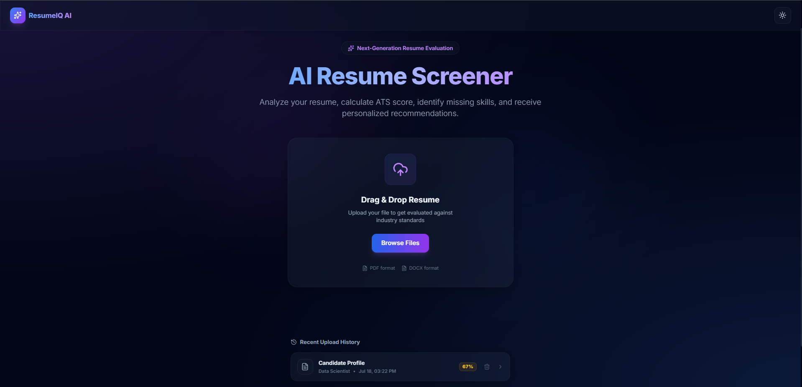
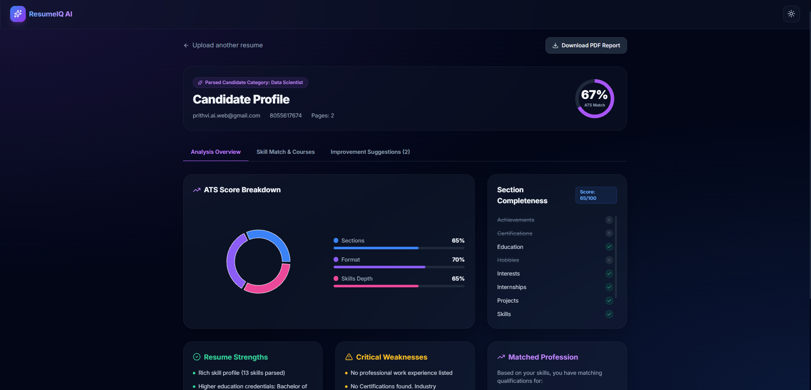
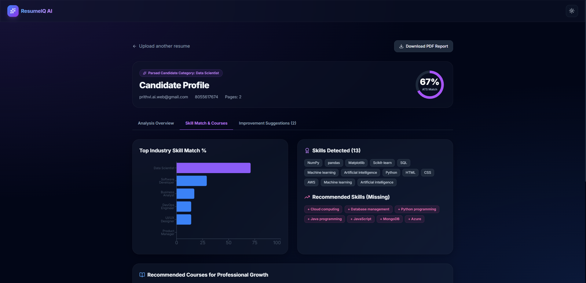

# 🚀 ResumeIQ AI

<div align="center">

### AI-Powered Resume Screener & ATS Analyzer

Analyze resumes, calculate ATS scores, identify missing skills, recommend personalized courses, and receive intelligent resume improvement suggestions.

<br>


</div>

---

# 📖 Overview

ResumeIQ AI is an intelligent resume evaluation platform that helps job seekers optimize their resumes for Applicant Tracking Systems (ATS).

It automatically parses resumes, extracts skills, calculates ATS scores, identifies missing skills, recommends relevant learning resources, and provides personalized suggestions to improve resume quality.

---

# ✨ Features

- 📄 Resume Parsing
- 📊 ATS Score Analysis
- 🧠 Skill Extraction
- 🎯 Profession Matching
- ❌ Missing Skills Detection
- 📚 Course Recommendations
- 💪 Resume Strength Analysis
- ⚠️ Resume Weakness Detection
- 📈 Interactive Analytics Dashboard
- 🌙 Modern Responsive Interface

---

# 📸 Screenshots

## 🏠 Home Page



---

## 📊 ATS Score Dashboard



---

## 🎯 Skill Match & Recommendations



---

# 🛠 Tech Stack

### Frontend

- React
- TypeScript
- Tailwind CSS
- Framer Motion

### Backend

- Flask
- Python

### AI / NLP

- spaCy
- NLTK
- PyResParser

---

# 🚀 Installation

Clone the repository

```bash
git clone https://github.com/prithviraj-shahapure/ResumeIQ-AI.git
```

Go to the project folder

```bash
cd ResumeIQ-AI
```

Create a virtual environment

```bash
python -m venv venv
```

Activate it

### Windows

```bash
venv\Scripts\activate
```

### Linux / macOS

```bash
source venv/bin/activate
```

Install dependencies

```bash
pip install -r requirements.txt
```

Run the application

```bash
python app.py
```

Open in your browser

```
http://127.0.0.1:5000
```

---

# 📂 Project Structure

```
ResumeIQ-AI
│
├── app.py
├── requirements.txt
├── README.md
├── LICENSE
├── routes/
├── templates/
├── static/
├── data/
└── Screenshots/
```

---

# 🚀 Future Improvements

- 🤖 LLM-powered Resume Review
- 📄 Job Description Matching
- 💼 Resume Optimization
- 🎤 AI Interview Preparation
- 📥 Export PDF Report
- 👤 User Authentication
- ☁️ Cloud Deployment

---

# 👨‍💻 Developer

**Prithviraj Shahapure**

B.Tech Artificial Intelligence & Machine Learning

---

# 📄 License

This project is licensed under the GPL-2.0 License.

---

<div align="center">

⭐ If you like this project, don't forget to star the repository!

Made with ❤️ using Python, Flask, React & AI

</div>